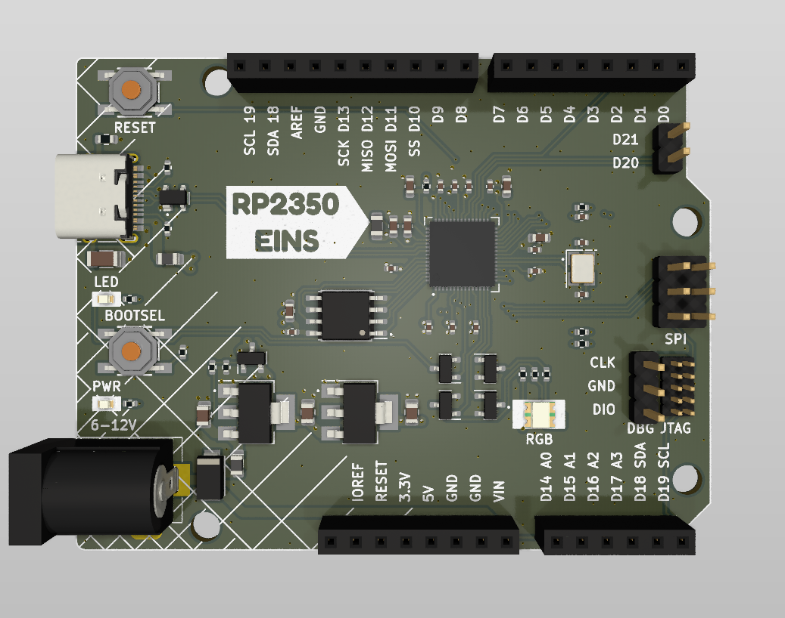
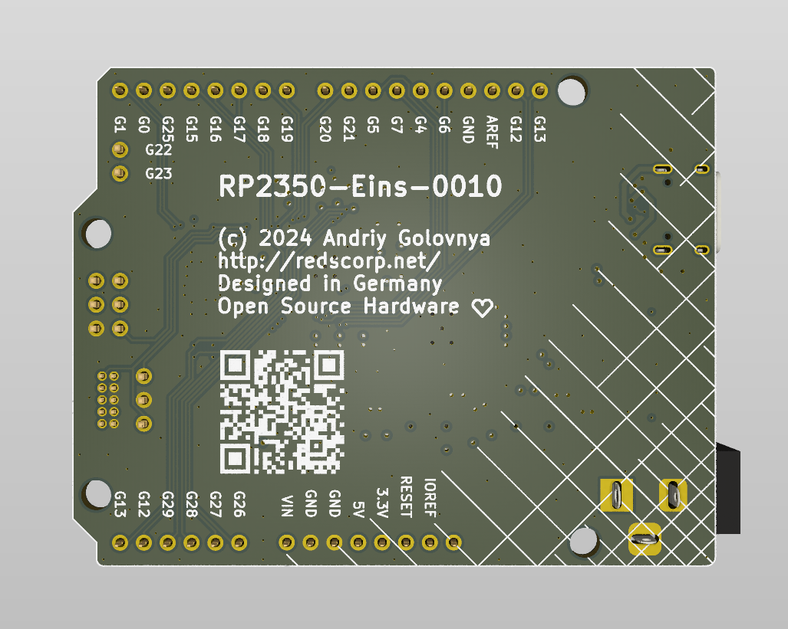
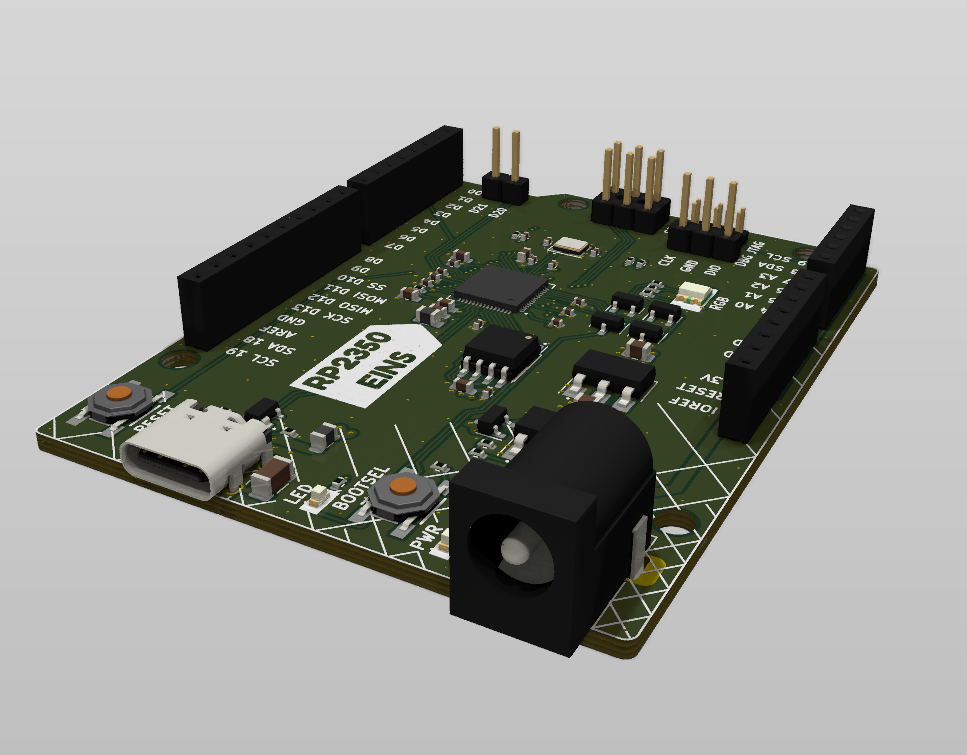

```
  _____  _____ ___  ____  _____  ___         ______ _____ _   _  _____ 
 |  __ \|  __ \__ \|___ \| ____|/ _ \       |  ____|_   _| \ | |/ ____|
 | |__) | |__) | ) | __) | |__ | | | |______| |__    | | |  \| | (___  
 |  _  /|  ___/ / / |__ <|___ \| | | |______|  __|   | | | . ` |\___ \ 
 | | \ \| |    / /_ ___) |___) | |_| |      | |____ _| |_| |\  |____) |
 |_|  \_\_|   |____|____/|____/ \___/       |______|_____|_| \_|_____/ 
```

# RP2350-Eins Project

The **RP2350-Eins** project aims to create a replacement for the Arduino UNO R3 or Arduino M0 using the RP2350 MCU.
This project was born as a continuation my previous project, [RP2040-Eins](https://github.com/red-scorp/RP2040-Eins), which was based on the Raspberry Pi RP2040 MCU.

## RP2350-Eins Board

The **RP2350-Eins** board is a 4-layer design intended to accommodate the popular Raspberry Pi RP2350 MCU within the standard Arduino UNO R3 footprint.

This board is crafted in Germany, and its name, "RP2350-Eins", incorporates the German word "Eins" (pronounced as "eye-ns"), which translates to "one". This name choice reflects the use of the same form-factor as the Arduino "Uno", which means "one" in Italian.

Preview:





You can view the [Schematics in PDF format](doc/RP2350-Eins.pdf) for detailed information.

STEP 3D file is available [with pins](doc/RP2350-Eins.step).

Features:

- Arduino UNO compatible pinout
- Partially compatible with Arduino Nano RP2350 Connect pinout
- Dual-core Cortex-M0+ Raspberry Pi RP2350
- 21 GPIO pins, including 4 analog inputs
- USB Type-C connector
- JTAG and DBG debugging connectors
- LDO-based 5V and 3.3V power supply with a maximum 12V input
- Supports both SOIC and WSON 16MB flash packages
- Includes power, user and RGB LEDs

CAM files, as well as the BOM and CPL files for JLCPCB, are available.

### Board Pinout

Following pinout is used for the board:

| Board Pin | RP2350 Pin | Function | Notes |
| --------- | ---------- | -------- | ----- |
| D0        | GPIO1      | UART0 TX |       |
| D1        | GPIO0      | UART0 RX |       |
| D2        | GPIO25     |          |       |
| D3        | GPIO15     |          |       |
| D4        | GPIO16     |          |       |
| D5        | GPIO17     |          |       |
| D6        | GPIO18     |          |       |
| D7        | GPIO19     |          |       |
| D8        | GPIO20     |          |       |
| D9        | GPIO21     |          |       |
| D10       | GPIO5      | SS       |       |
| D11       | GPIO7      | MOSI     |       |
| D12       | GPIO4      | MISO     |       |
| D13       | GPIO6      | SCK      | LED   |
| D14 A0    | GPIO26     |          |       |
| D15 A1    | GPIO27     |          |       |
| D16 A2    | GPIO28     |          |       |
| D17 A3    | GPIO29     |          |       |
| D18       | GPIO12     | SDA      |       |
| D19       | GPIO13     | SCL      |       |
| D20       | GPIO22     |          |       |
| D21       | GPIO23     |          |       |
| LED_R     | GPIO9      |          |       |
| LED_G     | GPIO10     |          |       |
| LED_B     | GPIO11     |          |       |

## Version History

This board exists in a single LDO-based flavor. If you want to use a Buck-based version of this board, please contact me directly.

Each version of the board listed below is tagged in the repository. You can use the tag to checkout the repository to the specific version.

### v1.0b1 - xx.xx.2024


Initial release for testing purposes.

## Links

- [Raspberry Pi RP2350 information page](https://www.raspberrypi.com/documentation/microcontrollers/silicon.html#rp2350).
- [Arduino UNO R3 information page](https://docs.arduino.cc/retired/boards/arduino-uno-rev3-with-long-pins).
- [Arduino SDK for RP2350 board](https://github.com/earlephilhower/arduino-pico).

## How to Help

Your contributions as code, resources, or finances are welcome! Please contact me directly via email at andriy.golovnya@gmail.com or through my [GitHub profile](https://github.com/red-scorp).

If you'd like to make a financial contribution, you can donate via [PayPal](http://paypal.me/redscorp) or [Ko-Fi](http://ko-fi.com/redscorp). Your support is greatly appreciated.

Thanks in advance!
